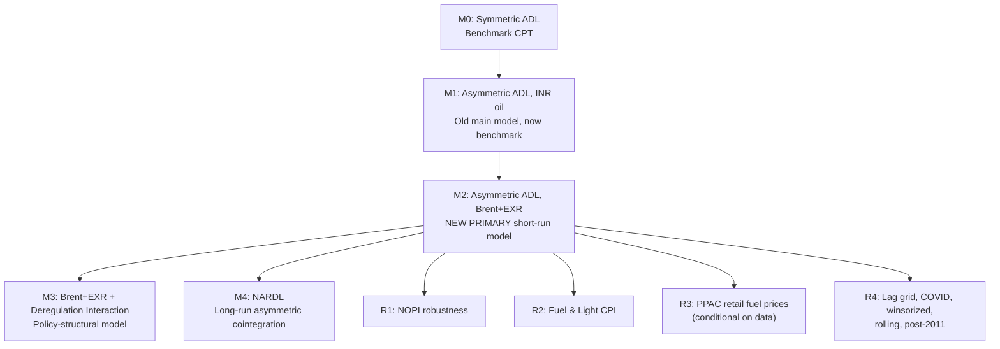

# Improved Dissertation Analysis: Oil Price Pass-Through to India's CPI

## Current State of the Problem

The existing `analysis.R` produces results where the Wald test for asymmetry **fails in every specification**:

- Main model (INR oil): p = 0.2408
- Brent+EXR model: p = 0.1443
- Fuel & Light CPI: p = 0.265

The causes are well-diagnosed in `suggestions.md`: CPI aggregation dilutes the oil signal (39% food), the INR-oil variable conflates two channels, and regulated fuel pricing pre-2014 suppresses pass-through.

## What I Will Implement (and Where I Differ from suggestions.md)

I agree with the suggestions document's diagnosis and fix ordering. My implementation will follow its prioritized sequence but with these additional improvements:

- **Better unit root battery:** ADF + Phillips-Perron + KPSS (confirmatory) + Zivot-Andrews (structural break). The current script only uses ADF. ZA is important because it can detect the 2010/2014 structural breaks in the series.
- **NARDL elevated in priority:** The suggestions rank NARDL as Fix 6 (optional Scopus upgrade). I will implement it as a core model because the long-run Wald test integrates information over many periods, giving it systematically more power than the short-run test. The `nardl` R package is already installed.
- **Block bootstrap over DWB:** The suggestions recommend Dependent Wild Bootstrap (Shao 2010). I will implement **block bootstrap** (Politis-Romano) instead — it is simpler to implement correctly, preserves serial dependence, and is the more common choice in applied time-series econometrics. DWB is sensitive to bandwidth selection.
- **Post-2011 CPI subsample:** The suggestions note pre-2010 CPI uses an OECD-reconstructed series. I will add a post-Jan-2011 subsample robustness check to address this directly.
- **PPAC data handled conditionally:** The script will check for PPAC data and run Fix 2 if available, skip gracefully otherwise. Instructions for manual download provided below.

## Data Requirements

**Already available** (in `data/raw/`):

- `INDCPIALLMINMEI.csv` — India CPI from FRED
- `POILBREUSDM.csv` — Brent crude from FRED
- `EXINUS.csv` — INR/USD exchange rate from FRED
- `iip_chained.xlsx` — IIP General Index from RBI DBIE

**Fetched automatically** (via MoSPI API, same as current script):

- CPI Fuel & Light sub-index (group_code=5)

**Manual download required for PPAC retail fuel prices** (Fix 2):

1. Pre-June 2017: Go to [ppac.gov.in RSP archive](https://ppac.gov.in/retail-selling-price-rsp-of-petrol-diesel-and-domestic-lpg/rsp-of-petrol-and-diesel-at-delhi-up-to-15-6-2017), download the Excel file of historical petrol/diesel RSP at Delhi
2. Post-June 2017: Go to [ppac.gov.in RSP current](https://ppac.gov.in/retail-selling-price-rsp-of-petrol-diesel-and-domestic-lpg/), download the daily RSP data
3. Save both in `data/raw/` as `ppac_rsp_pre2017.xlsx` and `ppac_rsp_post2017.xlsx`
4. The script will merge them, convert to monthly, and construct the PPAC model. **If these files are not present, the script skips Fix 2 cleanly.**

## Directory Structure

```
improved/
  run_all.R                    # Master orchestrator
  R/
    00_helpers.R               # Utility functions (NW lag, format_p, sig_stars, etc.)
    01_data.R                  # Data loading, merging, variable construction
    02_descriptives.R          # Descriptive stats table + raw/differenced plots
    03_unit_roots.R            # ADF + PP + KPSS + Zivot-Andrews
    04_models.R                # M0-M3: symmetric, asym-INR, asym-Brent+EXR, interaction
    05_nardl.R                 # M4: NARDL bounds test + long-run + dynamic multipliers
    06_bootstrap.R             # Block bootstrap Wald p-values for M1, M2, M3
    07_robustness.R            # NOPI, Fuel CPI, COVID, winsorized, rolling, lag grid, post-2011
    08_figures.R               # All publication-quality figures
  outputs/
    tables/
    figures/
```

## Model Hierarchy



## Key Implementation Details

### 03_unit_roots.R

- ADF via `tseries::adf.test` (existing)
- Phillips-Perron via `urca::ur.pp` (new)
- KPSS via `urca::ur.kpss` with null of stationarity (new, confirmatory)
- Zivot-Andrews via `urca::ur.za` for structural break detection in log levels (new)
- Output: comprehensive table with all four tests for all 8 series

### 04_models.R — Four Core Models

- **M0:** `dlnCPI ~ dlnCPI_L1 + dlnOil + dlnOil_L1 + dlnIIP + dummies` (symmetric baseline)
- **M1:** `dlnCPI ~ AR(p) + dlnOil_pos_L0:L3 + dlnOil_neg_L0:L3 + dlnIIP + dummies` (INR oil, Mork decomp)
- **M2:** `dlnCPI ~ AR(p) + dlnBrent_pos_L0:L3 + dlnBrent_neg_L0:L3 + dlnEXR + dlnEXR_L1 + dlnIIP + dummies` (Brent+EXR, primary model)
- **M3:** Same as M2 but with `D_post * dlnBrent_pos_Lk` and `D_post * dlnBrent_neg_Lk` interaction terms. Tests: (a) post-deregulation CPT+/CPT-, (b) post-deregulation asymmetry Wald, (c) significance of regime change. Parsimonious: use q=2 oil lags in the interaction block to preserve degrees of freedom.
- All use Newey-West HAC standard errors
- Single **comparison table** with all models side-by-side

### 05_nardl.R

- Uses `nardl::nardl()` with `lnCPI ~ lnOil_INR` and `lnCPI ~ lnBrent + lnEXR`
- Reports: bounds test F-statistic and critical values, long-run theta+ and theta-, long-run asymmetry Wald test, short-run coefficients, error correction term
- Dynamic multiplier plot (the signature NARDL figure)
- Checks: all variables are I(1) or I(0) per the unit root battery (NARDL valid for either)

### 06_bootstrap.R

- **Block bootstrap** (circular) with optimal block length via `b = floor(1.75 * T^(1/3))`
- B = 4999 replications
- For each replication: resample residual blocks, reconstruct dependent variable, re-estimate model, compute Wald F-statistic
- Report bootstrap p-value alongside asymptotic HAC p-value for M1, M2, M3

### 07_robustness.R

- **NOPI:** Hamilton (2003) net oil price increase = max(0, lnOil*t - max(lnOil*{t-1},...,lnOil\_{t-12})). Symmetric NOPI- constructed analogously. Cite Kilian-Vigfusson (2011) caution.
- **Fuel & Light CPI:** MoSPI API fetch, same as current. Report CPT+ significance and asymmetry Wald separately.
- **Post-2011 subsample:** CPI series from Jan 2011 onward (addresses OECD reconstruction concern).
- **COVID sensitivity, Winsorization, Rolling window, Lag grid:** Same as current but cleaner implementation.

### Output Tables (expected ~18-20 tables)

- Descriptive statistics, Variable definitions
- Unit root battery (all 4 tests)
- M0 baseline, M1 asymmetric INR (benchmark), M2 Brent+EXR (primary), M3 interaction
- Wald test comparison across models (single table)
- NARDL bounds test, NARDL long-run coefficients
- Bootstrap p-values
- NOPI robustness, Fuel CPI appendix
- Lag grid sensitivity, COVID, Winsorized, Post-2011
- Comprehensive model comparison table (all models side-by-side)

### Output Figures (expected ~12-14 figures)

- Raw series (4 panels), Log-differenced series (4 panels)
- Oil decomposition partial sums
- Cumulative pass-through by horizon (M2)
- NARDL dynamic multiplier plot (signature figure)
- CUSUM stability plot
- Residual diagnostics (4 panels)
- Rolling window CPT+/CPT-
- Oil price regimes annotated
- Asymmetry gap comparison (all models)
- Zivot-Andrews break point visualization
- Subsample comparison bar chart

## R Package Dependencies

All already installed: `tidyverse`, `readxl`, `tseries`, `lmtest`, `sandwich`, `car`, `strucchange`, `stargazer`, `patchwork`, `scales`, `zoo`, `jsonlite`, `urca`, `nardl`, `boot`
